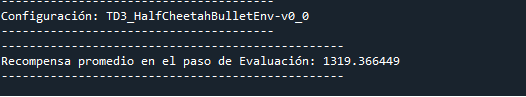

# TD3 algorithm 

Este repo lo hice fundamentalmente para modulizar el código del algoritmo TD3 y entenderlo en un contexto educacional, haciendo el clásico ejemplo de hacer caminar a un Cheetah,
en donde los entornos fueron sacados gym y pybullet.

Mi objetivo en el repo es estudiar y llevar esto al contexto de optimización de un proceso que tiene un espacio de acciones continuo en un proceso minero y de manufactura.

Recomiendo el curso:
* https://www.udemy.com/course/aprendizaje-por-refuerzo-profundo/ que me lo recomendó @sebawsky 
 
 # Organización
 
```zh
│   .gitignore
│   inference.py  ---> hacer inferencia con lo ya entrenado
│   README.md  
│   train.py  ---> entrenar el algoritmo
│
├───documents ---> paper
│       README.md
│       TD3.pdf
│
├───exp
│   └───brs
│       └───monitor ---> video
│               openaigym.video.0.33720.video000000.meta.json
│               openaigym.video.0.33720.video000001.meta.json
│               openaigym.video.0.33720.video000008.meta.json
│               openaigym.video.0.33720.video000027.meta.json
│               openaigym.video.0.33720.video000064.meta.json
│               openaigym.video.0.33720.video000125.meta.json
│               openaigym.video.0.33720.video000216.meta.json
│               openaigym.video.0.33720.video000343.meta.json
│               openaigym.video.0.33720.video000512.meta.json
│
├───images  ---> resultados
│       training.png  
│       training_results.png
│
├───pytorch_models
│       TD3_HalfCheetahBulletEnv-v0_0_actor.pth   ---> actor del modelo
│       TD3_HalfCheetahBulletEnv-v0_0_critic.pth  ---> critico del modelo
│
├───results
│       TD3_HalfCheetahBulletEnv-v0_0.npy
│
└───src
        actor.py   --> clase para los actores
        config.py  --> config
        critic.py  --> clase para los criticos  
        evaluate.py  --> evaluar [obtener un reward]
        inference_module.py --> clases para hacer inferencia con los modelos guardados
        replayBuffer.py --> clase de experiencia de repetición
        td3.py --> algoritmo
        utils.py 
        visualizations.py
        __init__.py

```
 
 # Resultado de entrenamiento
 
<p align="center">
  
</p>

<p align="center">
  
</p>

1:30 de entrenamiento en una rtx3080 [max-q]
 
# Biblografía

Paper
* https://github.com/matheus695p/td3/blob/main/documents/TD3.pdf

Repo del autor donde implemento el algoritmo y todos sacamos conocimiento
* https://github.com/sfujim/TD3


